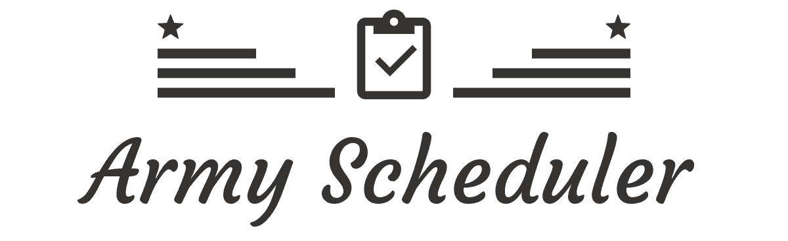

# Army Scheduler
<p align="center">
    
    <a href="https://opensource.org/licenses/MIT"></a>
    <a href="https://github.com/osamhack2021/CLOUD_WEB_ArmyScheduler_Youngs/graphs/contributors"></a>
</p>
<br/>




## 프로잭트 소개
- 대한민국에 존재하는 대부분의 군부대에서는 미리 작성된 근무표를 통해 정해진 시간에 각자의 근무지에서 일을 합니다. 하지만 작성된 근무표가 얼마나 공정한지, 자신이 얼마나 근무를 서고 있는지, 개인정비시간 및 취침시간을 얼마나 침해받는지를 확인할 수 있는 시스템이 존재하지 않습니다. 그리고 용사들이 휴가를 나가거나 훈련 등 부대 행사가 계획될 때마다 근무표는 계속 수정되기 마련이며 순번도 계속 꼬이게 됩니다. 
- Army Scheduler 웹 서비스에서 공정한 근무표를 도출함으로써 모든 인원들이 최대한의 휴식 여건을 보장받고, 과중한 업무 부담을 가지는 용사가 생기지 않도록 공정한 근무표를 자동으로 작성해주는 웹 서비스를 개발하고자 합니다.


## 기능 설명
 - 개발 중

## 컴퓨터 구성 / 필수 조건 안내 (Prerequisites)
 - 권장: Google Chrome 버젼 77 이상
 - 

## 기술 스택 (Technique Used) 
### Server(back-end)
 - nodejs, php, java 등 서버 언어 버전 
 - express, laravel, sptring boot 등 사용한 프레임워크 
 - DB 등 사용한 다른 프로그램 
 
### Front-end
 - react.js, vue.js 등 사용한 front-end 프레임워크 
 - UI framework
 - 기타 사용한 라이브러리

## 설치 안내 (Installation Process)
```bash
$ git clone git주소
$ yarn or npm install
$ yarn start or npm run start
```


## 프로젝트 사용법 (Getting Started)
**마크다운 문법을 이용하여 자유롭게 기재**

구글 검색 - 마크다운 문법
[https://post.naver.com/viewer/postView.nhn?volumeNo=24627214&memberNo=42458017](https://post.naver.com/viewer/postView.nhn?volumeNo=24627214&memberNo=42458017)

편한 마크다운 에디터를 찾아서 사용
샘플 에디터 [https://stackedit.io/app#](https://stackedit.io/app#)
 

## 팀 정보 (Team Information)
- Chang-rim Lee (L1638@gmail.com), Github Id: L1636
- Han-gi Son (crisis51526@gmail.com), Github Id: crisis513


## 저작권 및 사용권 정보 (Copyleft / End User License)
 * [MIT](https://github.com/osamhack2021/CLOUD_WEB_ArmyScheduler_Youngs/blob/master/license.md)

This project is licensed under the terms of the MIT license.

※ [라이선스 비교표(클릭)](https://olis.or.kr/license/compareGuide.do)

※ [Github 내 라이선스 키워드(클릭)](https://docs.github.com/en/github/creating-cloning-and-archiving-repositories/creating-a-repository-on-github/licensing-a-repository)

※ [\[참조\] Github license의 종류와 나에게 맞는 라이선스 선택하기(클릭)](https://flyingsquirrel.medium.com/github-license%EC%9D%98-%EC%A2%85%EB%A5%98%EC%99%80-%EB%82%98%EC%97%90%EA%B2%8C-%EB%A7%9E%EB%8A%94-%EB%9D%BC%EC%9D%B4%EC%84%A0%EC%8A%A4-%EC%84%A0%ED%83%9D%ED%95%98%EA%B8%B0-ae29925e8ff4)
