<h1 align="center">Army Scheduler Documentation</h1>

<p align="center">
    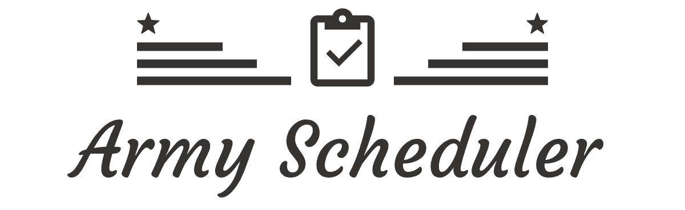
</p>

<p align="center">
    
    <a href="https://opensource.org/licenses/MIT"></a>
    <a href="https://github.com/osamhack2021/CLOUD_WEB_ArmyScheduler_Youngs/graphs/contributors"></a>
</p>

<br/>

## 🎪 프로젝트 소개

대한민국에 존재하는 대부분의 군부대에서는 정해진 순번에 따라 미리 작성된 근무표를 통해 주어진 시간에 각자의 근무지에서 일합니다. 하지만 용사들의 휴가와 부대 훈련 등의 이유로 부대 일정이 변경될 때마다 간부는 본연의 임무에 집중하지 못하고 근무표를 고치는 업무에 시달립니다. 주먹구구식으로 근무표를 고치면 반드시 순번은 꼬이기 마련이고 이러한 일이 반복되다 보면 남들보다 과중하게 근무에 투입되는 용사가 생겨 결국 부대 사기 저하로 이어지게 됩니다.

Army Scheduler는 매번 일일이 근무표를 고치는 간부의 스트레스와 불공정한 근무로 인해 속앓이하는 용사들의 불만을 동시에 해소하는 **원클릭 근무표 작성** 웹 서비스입니다. 또한, Army Scheduler는 단순한 근무표 작성기에서 한 걸음 더 나아가 용사를 위한 군 생활 매니저, 간부를 위한 부대 관리 도우미의 기능까지 가집니다.

**Army Scheduler와 함께 당신의 내일을 설계하세요.**


<br/>

## 🎯 기능 설명

### **간부**

<table>
    <tbody>
		<tr>
			<td width="100%" align="center">
				<b>🏆 원클릭 근무표 작성 🏆</b>
			</td>
		</tr>
		<tr>
            <td width="100%" align="center">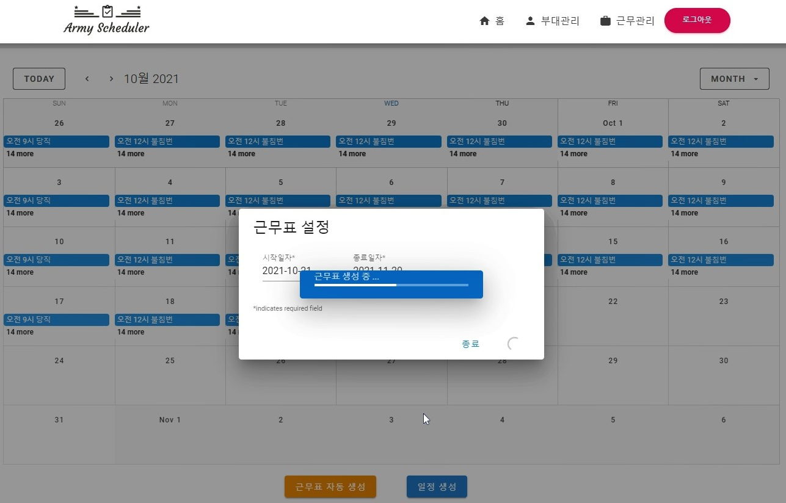</td>
        </tr>
   </tbody>
</table>

<br />

<table>
    <tbody>
		<tr>
			<td width="50%" align="center">
				<b>부대 일정 관리</b>
			</td>
            <td width="50%" align="center">
				<b>부대 근무 모니터링</b>
			</td>
		</tr>
		<tr>
            <td width="50%" align="center">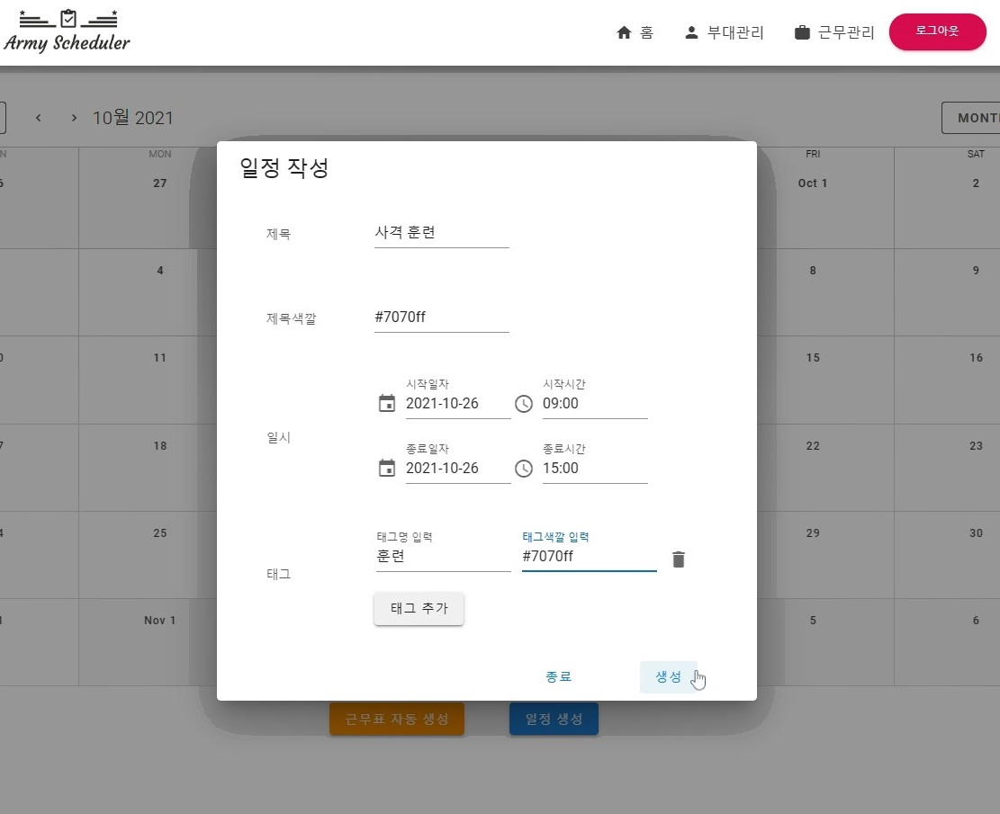</td>
            <td width="50%" align="center">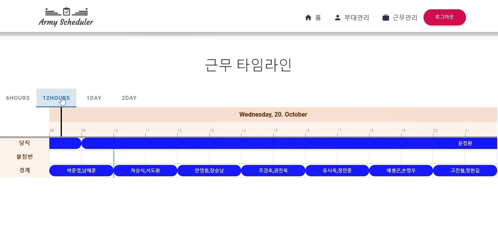</td>
        </tr>
   </tbody>
</table>

<br />

<table>
    <tbody>
		<tr>
			<td width="50%" align="center">
				<b>부대 인원 관리</b>
			</td>
            <td width="50%" align="center">
				<b>휴가 설정</b>
			</td>
		</tr>
		<tr>
            <td width="50%" align="center">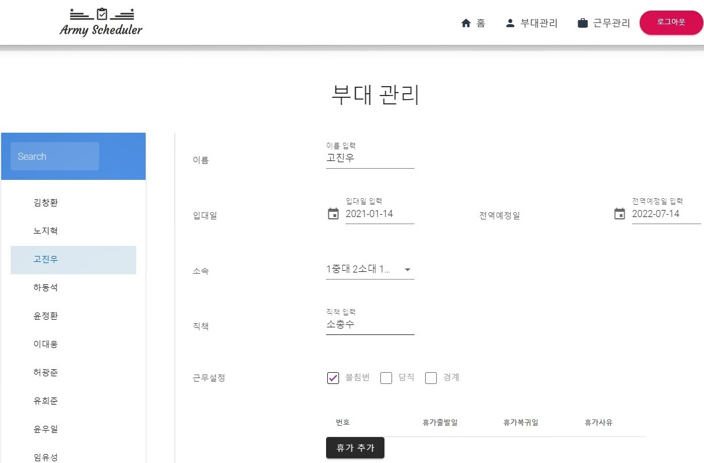</td>
            <td width="50%" align="center">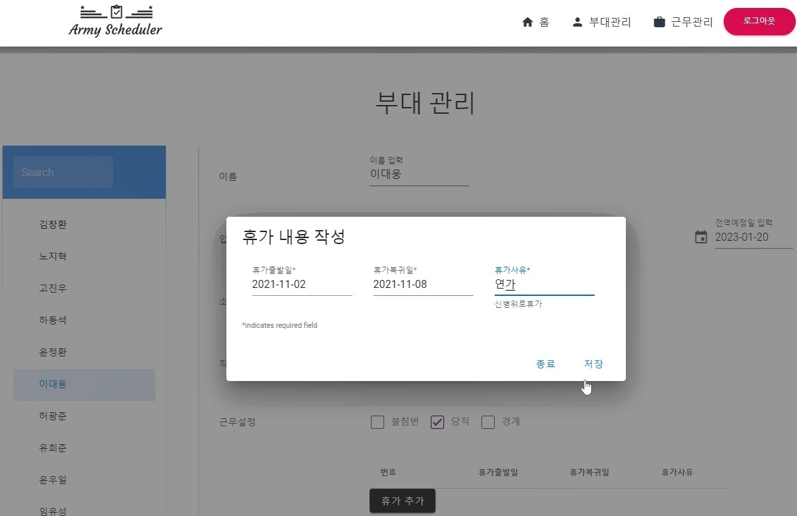</td>
        </tr>
   </tbody>
</table>

<br />

### **용사**

<table>
    <tbody>
		<tr>
			<td width="100%" align="center">
				<b>🏆 개인 근무 통계 확인 🏆</b>
			</td>
		</tr>
		<tr>
            <td width="100%" align="center">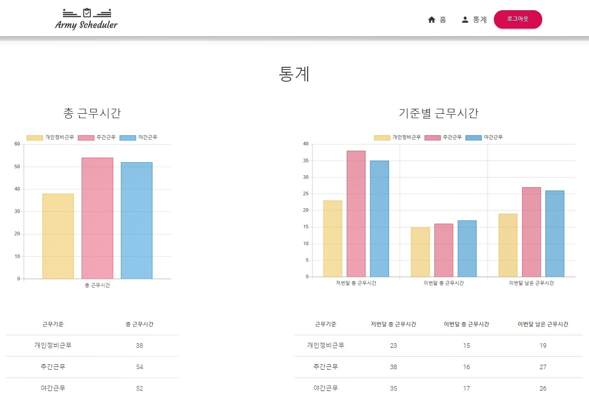</td>
        </tr>
   </tbody>
</table>

<br />

<table>
    <tbody>
		<tr>
			<td width="100%" align="center">
				<b>개인 일정 관리</b>
			</td>
		</tr>
		<tr>
            <td width="100%" align="center">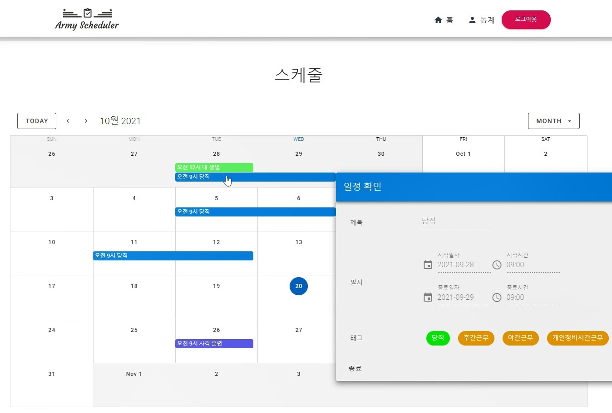</td>
        </tr>
   </tbody>
</table>

<br />

## 📣 컴퓨터 구성 / 필수 조건 안내 (Prerequisites)

<table>
    <tbody>
		<tr>
			<td>
				<b>Browser</b><br />
                <b>Version</b>
			</td>
            <td>
				<b>Chrome</b><br />
                <b>87</b>
			</td>
            <td>
				<b>Edge</b><br />
                <b>87</b>
			</td>
            <td>
				<b>Firefox</b><br />
                <b>85</b>
			</td>
            <td>
				<b>Opera</b><br />
                <b>72</b>
			</td>
            <td>
				<b>IE</b><br />
                <b>11</b>
			</td>
		</tr>
		<tr>
            <td>기능 지원</td>
            <td>✅</td>
            <td>✅</td>
            <td>✅</td>
            <td>✅</td>
            <td>❌</td>
        </tr>
   </tbody>
</table>

<br />

## 💡 기술 스택 (Technique Used) 

<div align="center"><a href="https://raw.githubusercontent.com/osamhack2021/CLOUD_WEB_ArmyScheduler_Youngs/master/docs/architecture.png">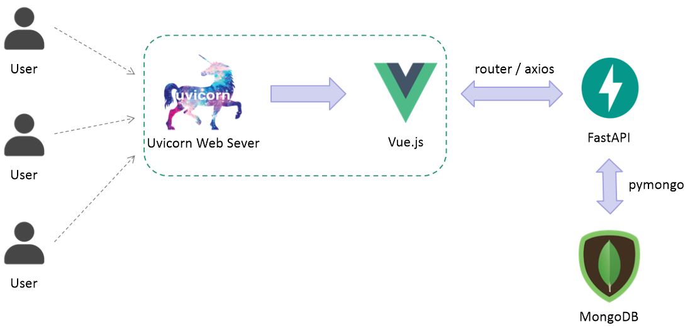</a></div>

<br />

### **Infra**


### **Backend**

  

### **Frontend**

         

### **Database**


<br />

## 개발 환경

<table>
    <tbody>
		<tr>
			<td>
				<b>OS</b>
			</td>
            <td>
				<b>Python</b>
			</td>
            <td>
				<b>npm</b>
			</td>
            <td>
				<b>Node.js</b>
			</td>
            <td>
				<b>MongoDB</b>
			</td>
		</tr>
		<tr>
            <td>Ubuntu 20.04.3 LTS</td>
            <td>3.8.5</td>
            <td>7.24.2</td>
            <td>14.17.6</td>
            <td>5.0.3</td>
        </tr>
   </tbody>
</table>

<br />

## 🧪 근무표 알고리즘

**대체 무엇이 공정한 것일까?**

공정한 근무표를 만들기 위해서는 먼저 어떤 근무표가 공정한 것인지에 대한 합의가 선행되어야만 합니다. 우리는 근무 피로도라는 개념을 도입하여 이를 해결하고자 했습니다. 모든 근무가 물론 힘들지만, 잠을 줄여가며 서는 야간 근무와 쉬는 시간을 뺏기는 개인 정비 시간 근무는 많은 용사들이 더욱 힘들어합니다. 이에, 야간 근무와 개인 정비 시간 근무에 가중치를 두어 더 큰 피로도를 가지도록 하였습니다.

**Army Scheduler의 작동 원리**

Army Scheduler는 과중한 근무 피로도를 가지는 용사가 생기지 않도록 근무를 배분합니다. 부대 훈련, 휴가, 다양한 근무 옵션 등으로 인해 규칙적인 근무가 불가능한 상황에 대응하기 위해 근무 순번이라는 개념을 아예 배제하였습니다. 그 대신, 백트래킹을 이용하여 모든 경우의 수를 탐색하는 방식으로 최적의 근무표를 찾아냅니다. 중대 이상 규모의 인원에 수십일 분량의 근무표를 단번에 작성하더라도 수초 내에 최상의 결과를 얻을 수 있도록 다양한 휴리스틱을 이용한 가지치기도 적용하였습니다.

<br />

## 🚀 서비스 흐름도

<div align="center"><a href="https://raw.githubusercontent.com/osamhack2021/CLOUD_WEB_ArmyScheduler_Youngs/master/docs/serviceflow.png">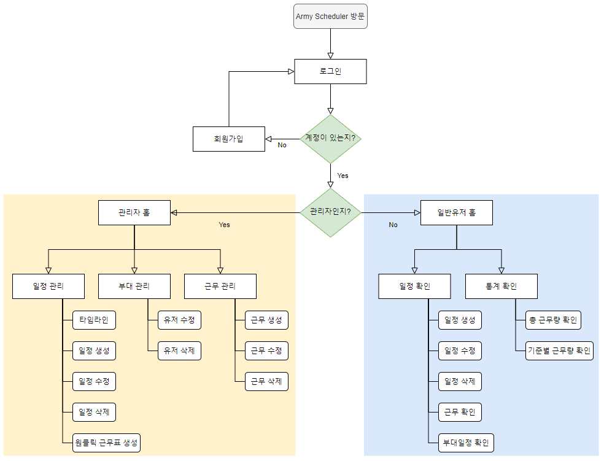</a></div>

<br />

## 💾 데이터베이스 설계

<div align="center"><a href="https://raw.githubusercontent.com/osamhack2021/CLOUD_WEB_ArmyScheduler_Youngs/master/docs/db.png">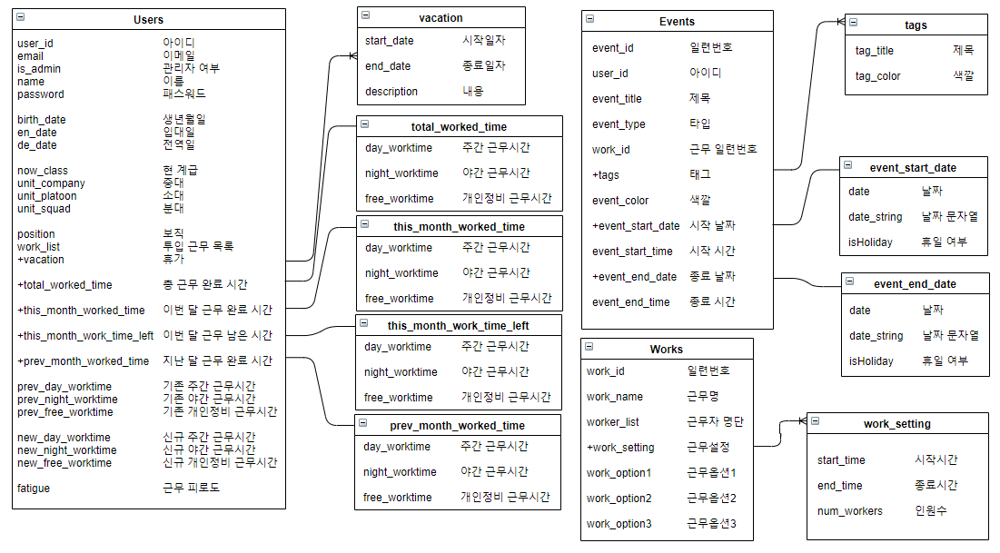</a></div>

<br />

## ⚡ 설치 안내 (Installation Process)

1. Army Scheduler Git 다운로드

    ```bash
    $ git clone https://github.com/osamhack2021/CLOUD_WEB_ArmyScheduler_Youngs.git
    ```

2. Frontend 구동에 필요한 모듈 설치

    ```bash
    $ cd CLOUD_WEB_ArmyScheduler_Youngs/WEB\(FE\)/
    $ npm install
    ```

3. Backend 구동에 필요한 모듈 설치

    ```bash
    $ cd ../WEB\(BE\)/

    # virtualenv 모듈 사용시
    $ virtualenv venv
    $ venv/bin/pip install -r requirements.txt

    # 파이썬 가상환경 설정 없을시
    $ pip install -r requirements.txt
    ```

4. Vue Build 및 Fastapi 구동

    ```bash
    # virtualenv 모듈 사용시
    $ chmod +x build_and_run.sh
    $ ./build_and_run.sh

    # 파이썬 가상환경 설정 없을시
    # build_and_run.sh 내용 참고 (venv/bin 부분 제거 후 실행)
    ```
<br />

## 🗽 Team Youngs

<table width="900">
<thead>
    <tr>
        <th width="100" align="center">Profile</th>
        <th width="100" align="center">Name</th>
        <th width="250" align="center">Role</th>
        <th width="150" align="center">Github</th>
        <th width="300" align="center">E-mail</th>
    </tr> 
</thead>

<tbody>
    <tr>
        <td width="100" align="center"></td>
        <td width="100" align="center">이창림</td>
        <td width="250">백엔드 개발<br>데이터베이스 개발<br>문서작업 등</td>
        <td width="150" align="center">	
	        <a href="https://github.com/L1638">
	            
	        </a>
        </td>
        <td width="300" align="center">
            <a href="mailto:lcr7324@gmail.com">
                
            </a>
        </td>
    </tr>
    <tr>
        <td width="100" align="center"></td>
        <td width="100" align="center">손한기</td>
        <td width="250">프론트엔드 개발<br>인프라 구축<br>문서작업 등</td>
        <td width="150" align="center">	
	        <a href="https://github.com/crisis513">
	            
	        </a>
        </td>
        <td width="300" align="center">
            <a href="mailto:crisis51526@gmail.com">
                
            </a>
        </td>
    </tr>
</tbody>
</table>

<br />

## ⚠ 저작권 및 사용권 정보 (License)

[MIT](https://github.com/osamhack2021/CLOUD_WEB_ArmyScheduler_Youngs/blob/master/license.md) License Copyright (c) 2021 Army Scheduler
