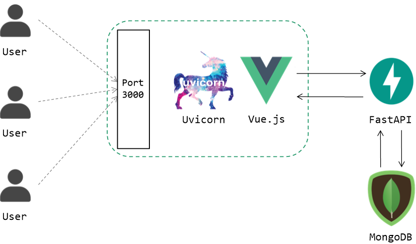

<h1 align="center">Army Scheduler Documentation</h1>

<p align="center">
    
</p>

<p align="center">
    
    <a href="https://opensource.org/licenses/MIT"></a>
    <a href="https://github.com/osamhack2021/CLOUD_WEB_ArmyScheduler_Youngs/graphs/contributors"></a>
</p>

<br/>

## 🎪 프로젝트 소개
대한민국에 존재하는 대부분의 군부대에서는 정해진 순번에 따라 미리 작성된 근무표를 통해 주어진 시간에 각자의 근무지에서 일을 합니다. 하지만 용사들의 휴가와 부대 훈련 등 근무표가 변경될 때마다 순번은 꼬이기 마련이고 이러한 일이 반복되다보면 남들보다 더 많은 근무에 투입되는 용사가 많이 발생하곤 합니다.

**Army Scheduler**는 일일히 반복적으로 근무표를 생성하고 수정하고 있는 간부와 불공정한 근무로 인해 속앓이하는 용사들의 문제점을 해소하고 모두에게 도움될 수 있는 **원클릭 근무표 작성** 웹 서비스를 개발하게 되었습니다.

<br/>

## 🎯 기능 설명

### 간부

- 부대 인원 관리 및 휴가 설정
- 부대 일정 관리
- 부대 근무 모니터링
- 부대 전체 근무 통계 확인
- 원클릭 근무표 작성

### 용사

- 나의 근무 확인
- 개인 일정 추가
- 개인 근무 통계 확인

<br />

## 📣 컴퓨터 구성 / 필수 조건 안내 (Prerequisites)

 - 권장: Google Chrome 버전 77 이상
 - 향후 테스트 예정

<br />

## 💡 기술 스택 (Technique Used) 

<div align="center"><a href="https://raw.githubusercontent.com/osamhack2021/CLOUD_WEB_ArmyScheduler_Youngs/master/docs/architecture.png"></a></div>

<br />

### **Infra**


### **Backend**

  

### **Frontend**

         

### **Database**


<br />

## 서비스 흐름도

<div align="center"><a href="https://raw.githubusercontent.com/osamhack2021/CLOUD_WEB_ArmyScheduler_Youngs/master/docs/serviceflow.png"></a></div>

<br />

## 설치 안내 (Installation Process)

1. Army Scheduler Git 다운로드

    ```bash
    $ git clone https://github.com/osamhack2021/CLOUD_WEB_ArmyScheduler_Youngs.git
    ```

2. Frontend 구동에 필요한 모듈 설치

    ```bash
    $ cd CLOUD_WEB_ArmyScheduler_Youngs/WEB\(FE\)/
    $ npm install
    ```

3. Backend 구동에 필요한 모듈 설치

    ```bash
    $ cd ../WEB\(BE\)/

    # virtualenv 모듈 사용시
    $ virtualenv venv
    $ venv/bin/pip install -r requirements.txt

    # 파이썬 가상환경 설정 없을시
    $ pip install -r requirements.txt
    ```

4. Vue Build 및 Fastapi 구동

    ```bash
    # virtualenv 모듈 사용시
    $ chmod +x build_and_run.sh
    $ ./build_and_run.sh

    # 파이썬 가상환경 설정 없을시
    # build_and_run.sh 내용 참고 (venv/bin 부분 제거 후 실행)
    ```
<br />

## Team Youngs

<table width="900">
<thead>
    <tr>
        <th width="100" align="center">Profile</th>
        <th width="100" align="center">Name</th>
        <th width="250" align="center">Role</th>
        <th width="150" align="center">Github</th>
        <th width="300" align="center">E-mail</th>
    </tr> 
</thead>

<tbody>
    <tr>
        <td width="100" align="center"></td>
        <td width="100" align="center">이창림</td>
        <td width="250">백엔드 개발<br>데이터베이스 개발<br>문서작업 등</td>
        <td width="150" align="center">	
	        <a href="https://github.com/L1638">
	            
	        </a>
        </td>
        <td width="300" align="center">
            <a href="mailto:lcr7324@gmail.com">
                
            </a>
        </td>
    </tr>
    <tr>
        <td width="100" align="center"></td>
        <td width="100" align="center">손한기</td>
        <td width="250">프론트엔드 개발<br>인프라 구축<br>문서작업 등</td>
        <td width="150" align="center">	
	        <a href="https://github.com/crisis513">
	            
	        </a>
        </td>
        <td width="300" align="center">
            <a href="mailto:crisis51526@gmail.com">
                
            </a>
        </td>
    </tr>
</tbody>
</table>

<br />

## 저작권 및 사용권 정보 (Copyleft / End User License)

[MIT](https://github.com/osamhack2021/CLOUD_WEB_ArmyScheduler_Youngs/blob/master/license.md) License Copyright (c) 2021 Army Scheduler
